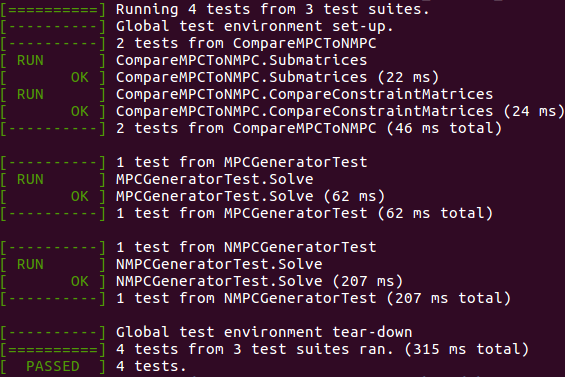

# Nonlinear Model Predictive Control for Walking Pattern Generation
This project implements [A Reactive Walking Pattern Generator Based on Nonlinear Model Predictive Control](https://hal.archives-ouvertes.fr/hal-01261415/document) to generate stable walking trajectories for a humanoid robot.

<br>
<figure>
  <p align="center"></p>
  <figcpation>Fig. 1: Visualization of generated walking trajectories with <a href="https://github.com/ORB-HD/MeshUp">MeshUp</a>.</figcaption>
</figure>
<br><br>

## Build

### Dependencies

## Usage
An example on how the NMPC pattern generator is ment to be used, can be executed by calling
```
cd build/bin
./nmpc_generator_example
```
The generated center of mass and feet trajectories are then written to `build/bin/example_nmpc_generator_interpolated_results.csv`. They can be visualized by 

```
cd plot
python plot_pattern.py
```

<br>
<figure>
  <p align="center"></p>
  <figcpation>Fig. 2: Generated center of mass and feet trajectories.</figcaption>
</figure>
<br><br>

We will go through the most important parts of the pattern generation in the following


```cpp
// Initialize pattern generator.
const std::string config_file_loc = "../../libs/pattern_generator/configs.yaml";

NMPCGenerator nmpc(config_file_loc);

// Pattern generator preparation.
nmpc.SetSecurityMargin(nmpc.SecurityMarginX(), 
                       nmpc.SecurityMarginY());

// Set initial values.
PatternGeneratorState pg_state = {nmpc.Ckx0(),
                                  nmpc.Cky0(),
                                  nmpc.Hcom(),
                                  nmpc.Fkx0(),
                                  nmpc.Fky0(),
                                  nmpc.Fkq0(),
                                  nmpc.CurrentSupport().foot,
                                  nmpc.Ckq0()};

nmpc.SetInitialValues(pg_state);
Interpolation interpol_nmpc(nmpc);
interpol_nmpc.StoreTrajectories(true);
Eigen::Vector3d velocity_reference(0., 0., 0.1);


// Pattern generator event loop.
for (int i = 0; i < 400; i++) {
    std::cout << "Iteration: " << i << std::endl;


    // Change reference velocities.
    if (50 <= i && i < 100) {
        velocity_reference << 0.1, 0., 0.1;
    }
    else if (100 <= i && i < 300) {
        velocity_reference << 0.1, 0., -0.1;
    }
    else if (300 <= i && i < 400) {
        velocity_reference << 0., 0., 0.;
    }


    // Set reference velocities.
    nmpc.SetVelocityReference(velocity_reference);


    // Solve QP.
    nmpc.Solve();
    nmpc.Simulate();
    interpol_nmpc.InterpolateStep();


    // Initial value embedding by internal states and simulation.
    pg_state = nmpc.Update();
    nmpc.SetInitialValues(pg_state);
}


// Save interpolated results.
Eigen::MatrixXd trajectories = interpol_nmpc.GetTrajectories().transpose();
WriteCsv("example_nmpc_generator_interpolated_results.csv", trajectories);
```


## Run Tests
To verify your installation, you can run the provided tests

```
cd build/bin
./pattern_generator_tests
```

It should output

<br>
<figure>
  <p align="center"></p>
  <figcpation>Fig. 3: Expected terminal output for testing.</figcaption>
</figure>
<br><br>
