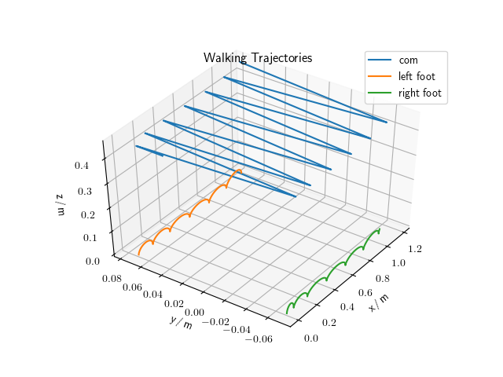

# Nonlinear Model Predictive Control for Walking Pattern Generation
This project implements [A Reactive Walking Pattern Generator Based on Nonlinear Model Predictive Control](https://hal.archives-ouvertes.fr/hal-01261415/document) to generate stable walking trajectories for a humanoid robot.

<br>
<figure>
  <p align="center">  <video autoplay loop muted inline><source src="img/heicub_user_controlled_walking.mp4" type="video/mp4"></video></p>
  <figcpation>Fig. 1: Visualization of generated walking trajectories with <a href="https://github.com/ORB-HD/MeshUp">MeshUp</a>.</figcaption>
</figure>
<br><br>

## Build
Once all dependencies are installed, build the project with

```shell
cd nmpc_pattern_generator
mkdir build && cd build
cmake ..
make
```

You can install and uninstall the project with

```shell
make install # to install
make uninstall # to uninstall
```

## Necessary Dependencies

### Eigen
The pattern generator is based on the blazingly fast Eigen library. To install it do

```
sudo apt install libeigen3-dev
```

You may need to create a symbolic link

```
sudo ln -s /usr/include/eigen3/Eigen/ /usr/include/
sudo ln -s /usr/include/eigen3/unsupported/ /usr/include/
```

### qpOASES
To solve the sequential quadratic program, we need to install qpOASES. Please follow the [install instructions](https://projects.coin-or.org/qpOASES/wiki/QpoasesInstallation), or head on as described below
```shell
wget https://www.coin-or.org/download/source/qpOASES/qpOASES-3.2.1.zip
unzip qpOASES-3.2.1.zip
cd qpOASES-3.2.1
```
Now since we want a shared library, in the `CMakeLists.txt` change `ADD_LIBRARY(qpOASES STATIC ${SRC})` to `ADD_LIBRARY(qpOASES SHARED ${SRC})`. Then procede with
```shell
mkdir build && cd build
cmake ..
make
sudo make install
```

### YAML
The configurations are read in using the YAML file format. Run the command
```shell
sudo apt install libyaml-cpp-dev
```

## Other Dependencies

To run the NMPC generator on a real robot or the simulation, we will need to install some more dependencies.

### RBDL
The rigid body kinematics are solved with RBDL. To install RBDL, do
```shell
hg clone https://bitbucket.org/rbdl/rbdl
cd rbdl
hg checkout dev
mkdir build && cd build
cmake -DCMAKE_BUILD_TYPE=Release -DRBDL_BUILD_ADDON_URDFREADER=ON ..
```

### PyTorch
For PyTorch to work in combination with RBDL, we need a source installation. Please checkout this [gist](https://gist.github.com/mhubii/1c1049fb5043b8be262259efac4b89d5) to figure out how to perform a clean setup.

### YARP
Additionally, for communicating with the real robot, or the simulation, we need [YARP](https://www.yarp.it/). To install YARP, follow the [installation instructions](https://www.yarp.it/install.html), or head on as described below
```shell
git clone https://github.com/robotology/yarp.git
cd yarp && mkdir build && cd build
```
If you have previously installed Anaconda, YARP may complain here. Go and install OpenCV within your Anaconda distribution
```shell
# activate your anaconda environment, if you followed the instructions before in PyTorch, do
# conda activate py37_torch
conda install opencv
```
Then do
```
cmake -DOpenCV_DIR=$HOME/anaconda3/envs/py37_torch/share/OpenCV ..
make
sudo make install
```

### Gazebo YARP Plugins
Plugins for Gazebo are used to clone the behaviour of the real robot into the simulation environment. Procede as below

```shell
git clone https://github.com/robotology/gazebo-yarp-plugins.git
cd gazebo-yarp-plugins
mkdir build && cd build
cmake -DCMAKE_INSTALL_PREFIX=$HOME/gazebo-yarp-plugins .. # install to $HOME or whatever you prefer
make
make install
```
Next, you need to tell Gazebo where to find the plugins, therefore add following to the `.bashrc`

```
export GAZEBO_PLUGIN_PATH=${GAZEBO_PLUGIN_PATH}:$HOME/gazebo-yarp-plugins/lib
```

### NCurses
For the visualization of the control pannel, we need to install ncurses, do

```
sudo apt install libncurses5-dev
```

## Usage
An example on how the NMPC pattern generator is ment to be used, can be executed by calling
```shell
cd build/bin
./nmpc_generator_example
```
The generated center of mass and feet trajectories are then written to `build/bin/example_nmpc_generator_interpolated_results.csv`. They can be visualized by 

```shell
cd plot
python plot_pattern.py
```

<br>
<figure>
  <p align="center"></p>
  <figcpation>Fig. 2: Generated center of mass and feet trajectories.</figcaption>
</figure>
<br><br>

We will go through the most important parts of the pattern generation in the following. The pattern generator reads in the configurations as a YAML file
```cpp
// Initialize pattern generator.
const std::string config_file_loc = "../../libs/pattern_generator/configs.yaml";

NMPCGenerator nmpc(config_file_loc);
```
Then, we need to set the initial values
```cpp
// Pattern generator preparation.
nmpc.SetSecurityMargin(nmpc.SecurityMarginX(), 
                       nmpc.SecurityMarginY());

// Set initial values.
PatternGeneratorState pg_state = {nmpc.Ckx0(),
                                  nmpc.Cky0(),
                                  nmpc.Hcom(),
                                  nmpc.Fkx0(),
                                  nmpc.Fky0(),
                                  nmpc.Fkq0(),
                                  nmpc.CurrentSupport().foot,
                                  nmpc.Ckq0()};
                                  
nmpc.SetInitialValues(pg_state);
```
We further interpolate between consecutive positions of the preview horizon and specify that we want to keep the interpolated points in memory, so we can safe them afterwards
```cpp
Interpolation interpol_nmpc(nmpc);
interpol_nmpc.StoreTrajectories(true);
```
Then, a desired velocity can be set, and the pattern generation will be executed for some steps
```cpp
Eigen::Vector3d velocity_reference(0.1, 0., 0.);

// Pattern generator event loop.
for (int i = 0; i < 100; i++) {
    std::cout << "Iteration: " << i << std::endl;

    // Set reference velocities.
    nmpc.SetVelocityReference(velocity_reference);

    // Solve QP.
    nmpc.Solve();
    nmpc.Simulate();
    interpol_nmpc.InterpolateStep();

    // Initial value embedding by internal states and simulation.
    pg_state = nmpc.Update();
    nmpc.SetInitialValues(pg_state);
}
```
Finally, we can store the resulting trajectories
```cpp
// Save interpolated results.
Eigen::MatrixXd trajectories = interpol_nmpc.GetTrajectories().transpose();
WriteCsv("example_nmpc_generator_interpolated_results.csv", trajectories);
```

## Run Tests
To verify your installation, you can run the provided tests

```shell
cd build/bin
./pattern_generator_tests
```

The tests are written with [googletest](https://github.com/google/googletest), which is included as a submodule. They should output

```shell
[==========] Running 4 tests from 3 test suites.
[----------] Global test environment set-up.
[----------] 2 tests from CompareMPCToNMPC
[ RUN      ] CompareMPCToNMPC.Submatrices
[       OK ] CompareMPCToNMPC.Submatrices (49 ms)
[ RUN      ] CompareMPCToNMPC.CompareConstraintMatrices
[       OK ] CompareMPCToNMPC.CompareConstraintMatrices (26 ms)
[----------] 2 tests from CompareMPCToNMPC (75 ms total)

[----------] 1 test from MPCGeneratorTest
[ RUN      ] MPCGeneratorTest.Solve
[       OK ] MPCGeneratorTest.Solve (69 ms)
[----------] 1 test from MPCGeneratorTest (69 ms total)

[----------] 1 test from NMPCGeneratorTest
[ RUN      ] NMPCGeneratorTest.Solve
[       OK ] NMPCGeneratorTest.Solve (225 ms)
[----------] 1 test from NMPCGeneratorTest (225 ms total)

[----------] Global test environment tear-down
[==========] 4 tests from 3 test suites ran. (369 ms total)
[  PASSED  ] 4 tests.
```
